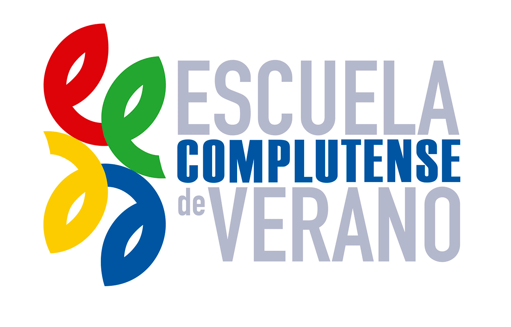

# Big & Open Data - R & Python programming

  

_Big & Open Data - R & Python programming_ is a three weeks long summer course organized by [Universidad Complutense Madrid](https://informatica.ucm.es/). You can find more information about the course [here](https://www.ucm.es/escuelacomplutense/b04)
